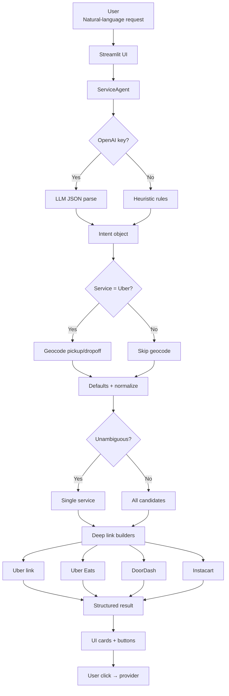
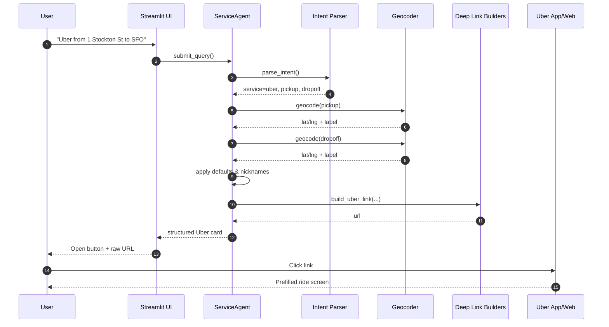
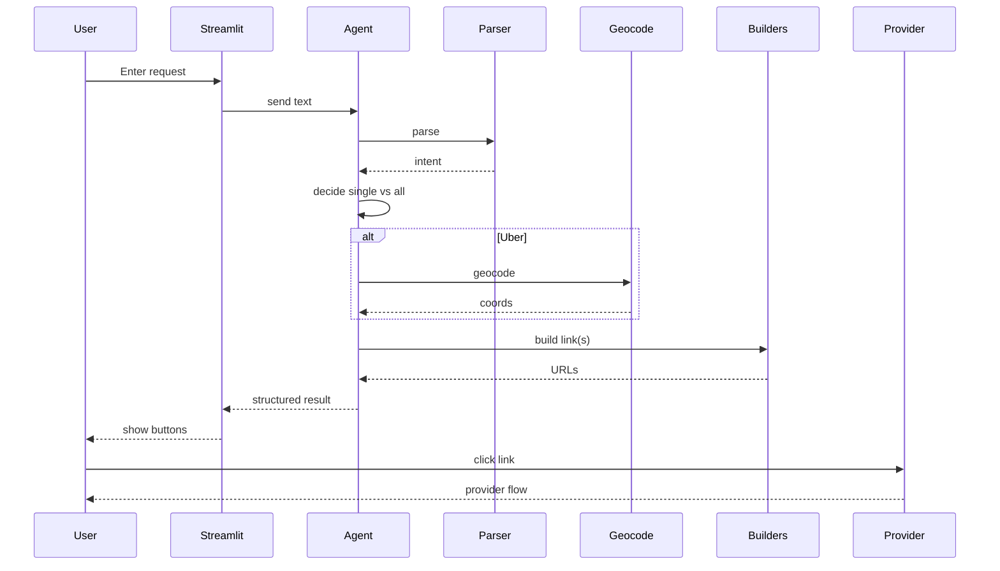
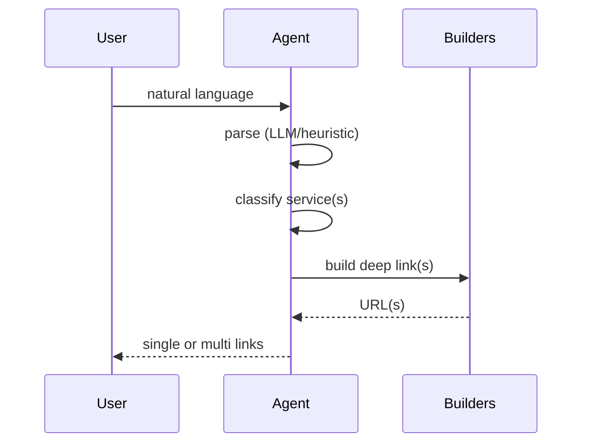

# 🚕🛒🍔 Services Hub (Agentic Deep Link Orchestrator)

One natural‑language prompt → the correct on‑demand service (Uber Ride, Uber Eats, Instacart, DoorDash) → an immediately actionable deep link.

The Hub interprets user intent, enriches it (geocoding for Uber rides), normalizes parameters, and returns a single service link (or multiple if ambiguous) with a clean, minimal UI.

---

## ✨ Key Features

| Capability | Description |
|------------|-------------|
| Single‑Prompt Intent | “Uber from 1 Stockton St to SFO”, “Uber Eats sushi”, “Order milk and eggs from Costco” |
| Smart Service Routing | Chooses exactly one service when unambiguous; otherwise shows all four options |
| Robust Uber Deep Links | Includes both bracket + simple lat/lng parameters, percent‑encoding, nicknames (“Home”, “Office”, “SFO”) |
| Food Search Preservation | Uber Eats & DoorDash deep links retain dish / cuisine / restaurant keywords |
| Grocery Queries | Instacart link composes a single `q=` with item/store/address hints |
| Heuristic + LLM Parsing | Uses OpenAI (if key available) for JSON intent; falls back to deterministic heuristics |
| No‑Fail Defaults | Always returns usable links (e.g. generic `food`, `groceries`) |
| Lightweight UI | Header image + one input; optional flow diagram (separate module) |

---

## 🧠 Intent Model

| Field | Services | Notes |
|-------|----------|-------|
| `service` | uber / ubereats / instacart / doordash | Auto‑classified |
| `pickup`, `dropoff` | Uber (rides) | Geocoded if possible |
| `ride_type` | Uber | Normalized (e.g., `uberX`, `uberXL`) |
| `items`, `preferred_store`, `address` | Instacart | Composed into `q=` search |
| `query`, `note` | DoorDash / Uber Eats | Cuisines, dishes, freeform hints |

---

## 🗂 Directory Highlights

```
app.py                # Streamlit UI (v14)
agents/orchestrator.py# ServiceAgent + intent parsing logic
utils/deeplinks.py    # Deep link builder functions
utils/geocode.py      # Geocoding helper (Nominatim wrapper)
flow_diagram.py       # (Optional) Mermaid diagram renderer
hub.png               # (Optional) Header image
```

---

## 🚀 Quick Start

```bash
python -m venv .venv
source .venv/bin/activate  # Windows: .venv\Scripts\activate
pip install -r requirements.txt
streamlit run app.py
```

Place a header image at one of:
```
hub.png
images/hub.png
assets/hub.png
static/hub.png
```

---

## 🔐 Optional OpenAI Configuration

Create `.streamlit/secrets.toml`:

```toml
OPENAI_API_KEY = "sk-..."
AGENT_MODEL = "gpt-4o-mini"
```

Without a key, heuristics still work; LLM parsing improves nuance (e.g., complex phrasing, multi‑part queries).

---

## 🧭 Deep Link Strategies

### Uber Ride
- Dual parameter strategy:
  - `pickup=<lat>%2C<lng>`
  - `pickup[latitude]=<lat>` / `pickup[longitude]=<lng>`
  - `pickup[formatted_address]=...`
- Same pattern for `dropoff[...]`
- Optional `productType=` if user specified (e.g. `uberX`).
- Strict percent‑encoding (`quote`, no plus signs for spaces).

### Instacart
- Single `q=` parameter merges freeform items + `store:<store>` + `near:<address>` hints.

### DoorDash
- Path segment search: `https://www.doordash.com/search/store/<encoded query>`.

### Uber Eats
- Query parameter: `https://www.ubereats.com/search?query=<encoded dish or cuisine>&diningMode=DELIVERY`.

---

## 🌐 Geocoding (Uber Only)

If the intent is Uber and addresses are provided:
1. Geocode pickup and dropoff.
2. Inject lat/lng + normalized label.
3. Provide nickname heuristics (“Home”, “Office”, airport codes, first segment truncation).

If geocoding fails, fallback keeps formatted text or `my_location`.

---

## 🧩 Parsing Flow (Conceptual)

1. Normalize user text.
2. If OpenAI key:
   - Ask LLM for JSON fields.
   - Validate & sanitize.
3. Else apply heuristics (keyword & regex extraction).
4. Derive service classification if missing.
5. For Uber: geocode.
6. Apply defaults (`food`, `groceries`) if unspecified.
7. Decide: single vs all candidate services.
8. Return structured response (service cards + links).

---

## 🛡 No‑Fail Principles

| Scenario | Behavior |
|----------|----------|
| Empty or vague request | Show all four services with generic queries |
| Missing Uber dropoff | Uber opens with pickup (current location) only |
| Unknown cuisine | Falls back to `food` |
| Missing grocery items | Falls back to `groceries` |

---

## 🧪 Sample Prompts

| Prompt | Result |
|--------|--------|
| `Uber from 1600 Amphitheatre Pkwy to SFO` | Uber deep link with geocoded pickup & SFO |
| `Uber Eats spicy ramen` | Uber Eats search (`spicy ramen`) |
| `Order milk and eggs from Costco` | Instacart with merged query |
| `Find sushi` | Ambiguous (cuisine): DoorDash vs Uber Eats vs maybe Uber? Returns all (unless heuristics bias) |
| `Take me to JFK` | Uber with `dropoff=JFK` (geocoded if resolved) |

---

## 📊 Full Architecture & Flow (Mermaid)



---

## 🔄 Primary (Detailed) Sequence (Uber Ride)



---

## ### Ultra‑Minimal Sequence Diagram

A concise Mermaid sequence diagram of the end‑to‑end flow (User → UI → Agent → Parsing → Optional Geocode → Link building → Provider). You can paste this directly into any Mermaid‑enabled viewer.



---

## 🧪 Testing Ideas

| Test | Expected |
|------|----------|
| Ride with only destination | Pickup defaults to `my_location` |
| Instacart with only store | Query includes `store:<store>` |
| Food query ambiguous | All services returned |
| Uber Eats dish with quotes | Preserves entire quoted phrase |
| Missing OpenAI key | Heuristic route still builds correct link |

---

## 📦 Deployment Notes

- Streamlit Cloud: Add secrets through the web UI (OPENAI_API_KEY).
- Docker (example snippet):
  ```dockerfile
  FROM python:3.11-slim
  WORKDIR /app
  COPY requirements.txt .
  RUN pip install -r requirements.txt
  COPY . .
  ENV STREAMLIT_SERVER_HEADLESS=true
  CMD ["streamlit", "run", "app.py", "--server.port=8501", "--server.address=0.0.0.0"]
  ```
- Ensure `hub.png` bundled if you rely on branding.

---

## 🔍 Future Enhancements

| Area | Idea |
|------|------|
| Service Expansion | Lyft, Grubhub, Amazon Fresh |
| Real API Integrations | Fare estimates, delivery ETAs |
| User Profiles | Saved addresses (Home/Office) |
| Observability | Structured logs / metrics for intent accuracy |
| Rate Limits | Geocode + LLM cooldown / caching |

---

## ⚖️ Disclaimer

This project constructs deep links but does not place orders or confirm rides. Users complete actions in official provider environments. Respect provider ToS; do not exceed fair geocoding / API usage limits.

---

## 📄 License

Specify your chosen license here (e.g., MIT, Apache 2.0).  
If absent, add a `LICENSE` file to clarify usage.

---

## 🙌 Contributing

1. Fork & branch: `feat/<short-description>`
2. Add tests/docs where applicable
3. Run lint & basic flow manual test
4. Open PR describing intent & any UX changes

---

### Quick Copy Snippet (Ultra‑Minimal Again)

(For embedding elsewhere)

<details>
<summary>Click to expand</summary>


</details>

---

**Enjoy the instant intent → action workflow!**  
Questions or ideas? Open an issue or start a discussion.